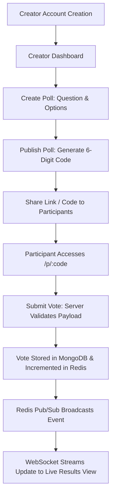
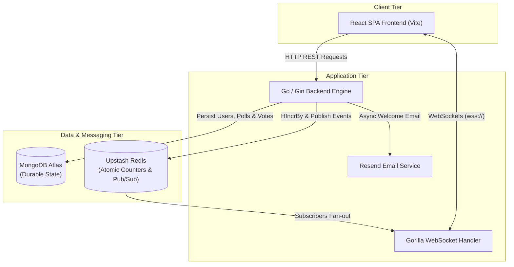

# PulsePoll

PulsePoll is a real-time audience polling application built to deliver instant, zero-friction audience engagement for presentations, lectures, and live events. Creators can quickly publish interactive polls, share a code or direct link, and observe live responses update in real time without refreshing the browser.

PulsePoll was developed as part of a technical assignment for HCL GUVI, focusing on scalable architecture, clean separation of concerns, and robust real-time state synchronization.

---

## Key Capabilities

- **Frictionless Participant Experience**: Participants join polls via a 6-digit code or direct link (`/p/:code`) without creating an account or downloading an app.
- **Creator Dashboard**: Authenticated creators can manage active and draft polls, publish with one click, and copy shareable participant links.
- **Single & Multiple Choice Polls**: Support for both single-choice voting and multi-option selection with dynamic percentage calculations.
- **Realtime Live Results**: Instant result updates powered by Redis Pub/Sub and WebSocket streaming to all connected participant and creator browsers.
- **Server-Side Input Validation**: Strict backend validation on all inputs (questions, option limits, choice types, voter payloads) before data reaches MongoDB or Redis.
- **Anti-Duplicate Voting**: Hybrid duplicate prevention using client voter session tokens (`X-Voter-ID`) and MongoDB unique compound indexes.
- **Welcome Email Notification**: Automated welcome emails dispatched upon creator registration via the Resend API.

---

## Core User Flow



---

## System Architecture

PulsePoll follows a decoupled architecture: a React Single Page Application (SPA) on the frontend and a Go/Gin REST & WebSocket engine on the backend, backed by MongoDB for durable state and Redis for real-time counters and Pub/Sub events.



---

## Tech Stack

### Frontend
- **Framework**: React 18 (Vite)
- **Styling**: Vanilla CSS Design System with CSS Custom Properties, HSL color tokens, glassmorphism UI elements, and fluid typography (`clamp`)
- **State & Routing**: Custom light-weight client router supporting dynamic SPA routes (`/p/:code`, `/p/:code/results`, `/dashboard`, `/login`, `/signup`)
- **Realtime Client**: Native browser `WebSocket` client with automatic reconnection logic

### Backend
- **Language/Runtime**: Go 1.22+ / 1.23
- **Web Framework**: Gin Web Framework (`github.com/gin-gonic/gin`)
- **WebSocket Streaming**: Gorilla WebSocket (`github.com/gorilla/websocket`)
- **Authentication**: JWT (`github.com/golang-jwt/jwt/v5`) & `golang.org/x/crypto/bcrypt`
- **Database Driver**: Official Mongo Go Driver (`go.mongodb.org/mongo-driver`)
- **Cache & Pub/Sub**: Go Redis Client (`github.com/redis/go-redis/v9`)

---

## Realtime Architecture & Data Flow

PulsePoll uses a dual-tier storage strategy for fast realtime throughput and long-term data durability:

```mermaid
sequenceDiagram
    autonumber
    actor Participant
    participant API as Go Backend API
    participant Mongo as MongoDB Atlas
    participant Redis as Upstash Redis
    participant WS as WebSocket Hub
    actor Clients

    Participant->>API: POST /api/v1/polls/:code/votes
    API->>Mongo: Check & Record Vote (Unique Compound Index)
    alt Vote Valid & Recorded
        API->>Redis: HIncrBy Option Counter & _total
        API->>Redis: Publish Event to pulsepoll:events:code
        Redis-->>API: Message Received on Subscribed Channel
        API->>WS: Broadcast Payload over WebSockets
        WS-->>Clients: Stream Live Vote JSON ({ results, total_votes })
        API-->>Participant: 201 Created (Vote Recorded)
    else Duplicate / Invalid Vote
        API-->>Participant: 409 Conflict / 400 Bad Request
    end
```

1. **Durable Writes**: When a vote is cast, the Go backend writes the vote record to MongoDB to guarantee durability.
2. **Atomic Counters**: Option counters are incremented in Redis using `HIncrBy`, ensuring fast concurrent tallying.
3. **Pub/Sub Broadcast**: An event is published to the Redis channel `pulsepoll:events:<code >`.
4. **WebSocket Fan-out**: The Go backend goroutine listening to the Redis Pub/Sub channel broadcasts updated JSON payloads to all connected WebSocket clients (`/api/v1/polls/:code/ws`).
5. **MongoDB Reconciliation**: If Redis counts are missing or cold upon startup, the backend automatically reconciles counts from MongoDB and populates Redis.

---

## Authentication & Security

- **Password Hashing**: Passwords are hashed using `bcrypt` with default cost factor before persistence.
- **Session Tokens**: Authenticated sessions issue signed JWT tokens containing claims (`sub`, `email`, `iat`, `exp`) valid for 24 hours.
- **Dual Token Transport Strategy**:
  - **HTTP-Only Cookies**: Set via `pulsepoll_session` cookie (`SameSite=None`, `Secure=true` in production) to mitigate XSS risks.
  - **Bearer Token Fallback**: Tokens are returned in JSON payloads and sent via `Authorization: Bearer <token>` headers to ensure reliability across cross-origin deployments.
- **CORS Protection**: Explicit Origin validation handling single/multiple origins and stripping trailing slashes dynamically (`CORS_ORIGIN`).

---

## Voting Validation & Duplicate Prevention

- **Server-Side Validation**:
  - Questions cannot be empty or whitespace-only.
  - Polls require between 2 and 6 non-empty options.
  - Choice type is sanitized to `single` or `multiple`.
  - Submitted option IDs must belong to the specified poll.
- **Anti-Duplicate Enforcement**:
  - **Client Voter ID**: Each participant session generates a unique `X-Voter-ID` token saved in `localStorage`.
  - **MongoDB Compound Index**: A unique index on `(poll_id, voter_id)` guarantees database-level duplicate prevention. Attempting to vote twice returns a `409 Conflict` error.
  - **Option Deduplication**: Duplicate option IDs submitted within a single multi-choice vote payload are stripped before processing.

---

## API Overview

| Endpoint | Method | Access | Description |
| :--- | :--- | :--- | :--- |
| `/api/v1/health` | `GET` | Public | Infrastructure health check and dependency latency status |
| `/api/v1/auth/signup` | `POST` | Public | Register new creator account (triggers welcome email) |
| `/api/v1/auth/login` | `POST` | Public | Authenticate creator and receive session cookie/token |
| `/api/v1/auth/logout` | `POST` | Public | Expire session cookie |
| `/api/v1/auth/me` | `GET` | Protected | Fetch current authenticated creator profile |
| `/api/v1/polls` | `POST` | Protected | Create a new poll (Draft or Active) |
| `/api/v1/polls` | `GET` | Protected | List all polls created by authenticated user |
| `/api/v1/polls/:id` | `GET` | Public / Creator | Fetch poll details by ObjectID or 6-digit Code |
| `/api/v1/polls/:id/publish` | `POST` | Protected | Publish a draft poll |
| `/api/v1/polls/:code/votes` | `POST` | Public | Submit participant vote(s) |
| `/api/v1/polls/:code/results` | `GET` | Public | Fetch current poll votes and percentages (REST) |
| `/api/v1/polls/:code/ws` | `GET` | Public | Establish WebSocket stream for live vote updates |

---

## Project Structure

```text
PulsePoll/
├── backend/
│   ├── cmd/
│   │   └── server/          # Main application entry point
│   ├── internal/
│   │   ├── config/          # Configuration & env variable loader
│   │   ├── database/        # MongoDB & Redis client connections
│   │   ├── handlers/        # Gin HTTP & WebSocket route handlers
│   │   ├── middleware/      # Auth, CORS, Logger, Recovery middleware
│   │   ├── models/          # Go structs (User, Poll, Vote, Payloads)
│   │   ├── repository/      # MongoDB data access layer
│   │   └── service/         # Business logic (Auth, Poll, Vote, Realtime, Email)
│   ├── Dockerfile           # Production Docker build container
│   ├── go.mod               # Go module dependencies
│   └── go.sum               # Dependency checksums
├── frontend/
│   ├── src/
│   │   ├── components/      # UI Components (Dashboard, LiveResultsView, etc.)
│   │   ├── context/         # AuthContext state manager
│   │   ├── services/        # API client & WebSocket connector
│   │   ├── App.jsx          # Router & main view manager
│   │   ├── index.css        # Core CSS Design System & design tokens
│   │   └── main.jsx         # React application root
│   ├── vercel.json          # Vercel SPA routing configuration
│   ├── package.json         # Frontend dependencies & build scripts
│   └── vite.config.js       # Vite configuration
├── docs/
│   └── architecture/        # System Architecture documentation
├── Dockerfile               # Root production Dockerfile
├── .env.example             # Template environment variables
└── README.md                # Project documentation
```

---

## Local Development & Setup

### Prerequisites
- **Go**: `1.22` or later
- **Node.js**: `18.x` or later
- **Docker** (optional, for running local MongoDB & Redis containers)

### 1. Start MongoDB and Redis
Using Docker:
```bash
docker run -d --name pulsepoll-mongo -p 27017:27017 mongo:latest
docker run -d --name pulsepoll-redis -p 6379:6379 redis:alpine
```

### 2. Start Backend Server
```bash
cd backend
go run cmd/server/main.go
```
The Go server starts on `http://localhost:8080`.

To run backend unit tests:
```bash
cd backend
go test -v ./...
```

### 3. Start Frontend App
```bash
cd frontend
npm install
npm run dev
```
The Vite frontend server starts on `http://localhost:5173`.

---

## Environment Variables

### Backend Environment Variables (`backend/.env` or deployment platform)

| Variable | Required | Default | Description |
| :--- | :--- | :--- | :--- |
| `PORT` | No | `8080` | Port for Go HTTP server |
| `ENVIRONMENT` | No | `development` | Set to `production` for Release mode |
| `MONGO_URI` | Yes | `mongodb://localhost:27017` | MongoDB connection string (Atlas or local) |
| `MONGO_DB` | No | `pulsepoll` | Target MongoDB database name |
| `REDIS_URL` | Optional | `""` | Full Redis connection URL (`rediss://...` or `redis://...`) |
| `REDIS_ADDR` | Optional | `localhost:6379` | Fallback Redis host:port if `REDIS_URL` is empty |
| `REDIS_PASSWORD` | Optional | `""` | Fallback Redis password |
| `JWT_SECRET` | Yes | `pulsepoll-secure-jwt-secret-key-2026` | Secret key for signing JWT session tokens |
| `CORS_ORIGIN` | No | `http://localhost:5173` | Allowed frontend origin URL(s), comma-separated |
| `RESEND_API_KEY` | Optional | `""` | Resend API key for welcome email notifications |
| `RESEND_FROM_EMAIL` | No | `PulsePoll <onboarding@resend.dev>` | Sending identity for welcome emails |
| `RESEND_TEST_RECIPIENT` | Optional | `""` | Test email override for Resend sandbox mode |

### Frontend Environment Variables (`frontend/.env` or Vercel)

| Variable | Required | Default | Description |
| :--- | :--- | :--- | :--- |
| `VITE_API_BASE_URL` | Yes | `http://localhost:8080/api/v1` | Backend API base URL |

---

## Production Deployment

### Frontend (Vercel)
- Set **Root Directory** to `frontend`.
- Set **Framework Preset** to `Vite`.
- Set Environment Variable `VITE_API_BASE_URL` to your backend URL (e.g. `https://your-backend.onrender.com/api/v1`).
- `frontend/vercel.json` provides SPA route rewriting for direct route navigation (`/p/:code`, `/dashboard`, etc.).

### Backend (Render)
- Deploy using **Docker**. The included `backend/Dockerfile` uses `golang:1.23-alpine` for building.
- Configure `MONGO_URI` (MongoDB Atlas), `REDIS_URL` (Upstash Redis), `JWT_SECRET`, `CORS_ORIGIN` (Vercel URL), and `ENVIRONMENT=production`.

### Resend Email Integration Note
- **Sandbox Mode**: When using Resend's free tier without a custom domain (`onboarding@resend.dev`), Resend enforces delivery to the verified account owner. Setting `RESEND_TEST_RECIPIENT` redirects welcome emails to your test inbox during development and demonstrations.
- **Production Mode**: Delivering welcome emails to arbitrary external user emails requires verifying a custom sending domain in the Resend dashboard.

---

## Verification & Testing

1. **Backend Unit Tests**:
   ```bash
   cd backend
   go test -v ./...
   ```
   Tests cover user authentication, password hashing, duplicate email rejection, poll creation, voting constraints, and anti-duplicate vote prevention.

2. **Frontend Production Build**:
   ```bash
   cd frontend
   npm run build
   ```

3. **Infrastructure Health Check**:
   Querying `GET /api/v1/health` returns status and latencies for MongoDB and Redis:
   ```json
   {
     "status": "ok",
     "environment": "production",
     "services": {
       "mongodb": { "status": "connected", "latency_ms": 231.43 },
       "redis": { "status": "connected", "latency_ms": 232.09 }
     }
   }
   ```

---

## AI-Assisted Development Note

This repository was developed with pair-programming assistance from Antigravity (Google DeepMind's agentic AI coding assistant). AI assistance was used for architectural exploration, boilerplate generation, CSS design system refinement, edge-case testing, and documentation formatting. All core application logic, database schemas, validation rules, and deployment configurations were audited, tested, and verified empirically against working runtime environments.

---

## Limitations & Future Enhancements

- **IP-Based Rate Limiting**: Currently, anti-duplicate voting relies on voter session tokens (`X-Voter-ID`). Adding IP/Device fingerprinting would provide an extra layer of prevention against intentional vote manipulation.
- **WebSocket Scaling**: For multi-instance horizontal scaling, a Redis adapter layer can be added to synchronize WebSocket connection hubs across multiple backend instances.
- **Custom Sending Domain**: Integrating a verified custom DNS domain for Resend to enable direct welcome email delivery to external user addresses without sandbox redirection.
